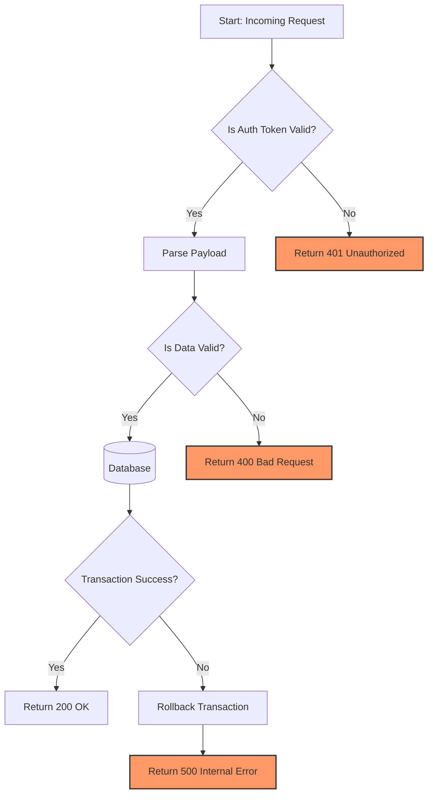
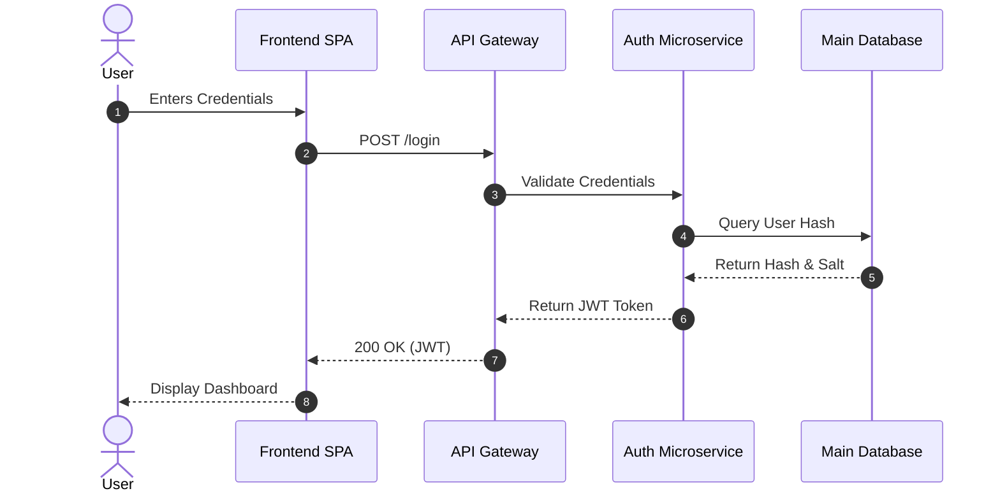
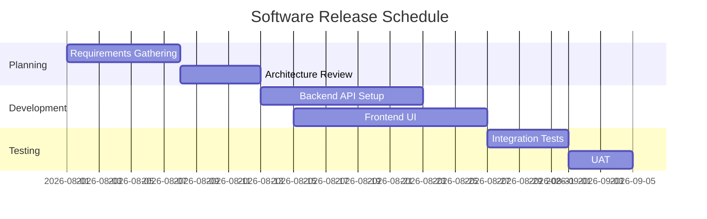

# 1. The Ultimate Comprehensive Markdown Reference Guide

Welcome to the most exhaustive Markdown showcase. This document tests the limits of Markdown parsers, encompassing standard Markdown (CommonMark), GitHub Flavored Markdown (GFM), inline HTML, Mermaid.js diagrams, and LaTeX mathematics.

## Table of Contents
1. [Headers & Typography](#1-headers--typography)
2. [Lists & Task Management](#2-lists--task-management)
3. [Links, Images & Assets](#3-links-images--assets)
4. [Blockquotes & Admonitions](#4-blockquotes--admonitions)
5. [Code, Syntax Highlighting & Diffs](#5-code-syntax-highlighting--diffs)
6. [Tables & Data Alignment](#6-tables--data-alignment)
7. [Mathematics (LaTeX)](#7-mathematics-latex)
8. [Mermaid.js Diagrams](#8-mermaidjs-diagrams)
9. [Advanced HTML Integration](#9-advanced-html-integration)
10. [Footnotes & References](#10-footnotes--references)

---

## 1. Headers & Typography

### Heading Level 3
#### Heading Level 4
##### Heading Level 5
###### Heading Level 6

Alternatively, using Setext style:

Heading Level 1
===============

Heading Level 2
---------------

### Text Formatting & Emphasis

Markdown allows for granular text styling:
* **Bold Text** (or __Bold Text__)
* *Italic Text* (or _Italic Text_)
* ***Bold and Italic Text*** (or ___Bold and Italic___)
* ~~Strikethrough Text~~
* `Inline Code` snippets
* ==Highlighted Text== (if supported by parser, otherwise HTML `<mark>highlighted</mark>`)
* Subscript: H~2~O or HTML <sub>H<sub>2</sub>O</sub>
* Superscript: X^2^ or HTML <sup>X<sup>2</sup></sup>

---

## 2. Lists & Task Management

### Unordered Lists (Mixed Delimiters)
* Level 1 item (Asterisk)
  - Level 2 item (Hyphen)
    + Level 3 item (Plus)
      * Level 4 item

### Ordered & Nested Lists
1. First step in the process.
2. Second step, which contains sub-steps:
   1. Sub-step A
   2. Sub-step B
      - Bullet inside ordered list
      - Another bullet
3. Third step with a blockquote:
   > This blockquote is indented to belong to step 3.
4. Fourth step.

### Task Lists (GitHub Flavored)
- [x] Write initial draft
- [x] Review complex syntax requirements
- [ ] Render Mermaid diagrams
- [ ] Publish documentation
  - [x] Sub-task A completed
  - [ ] Sub-task B pending

---

## 3. Links, Images & Assets

### Links
* [Standard Inline Link](https://example.com)
* [Inline Link with Title](https://example.com "Visit Example.com")
* [Reference-style Link][ref_link]
* Autolinks: <https://www.google.com> and email@example.com
* [Anchor Link to Top](#table-of-contents)

### Images


[](https://example.com)

*Reference for the link above:*
[ref_link]: https://developer.mozilla.org "MDN Web Docs"

---

## 4. Blockquotes & Admonitions

### Standard & Nested Blockquotes
> This is a standard blockquote.
> It can span multiple lines.
>
> > This is a nested blockquote.
> > It can go as deep as you need.
> > > Level 3 blockquote!

### GitHub-Flavored Alerts (Admonitions)
> [!NOTE]
> Useful information that users should know, even when skimming.

> [!TIP]
> Helpful advice for doing things better or more easily.

> [!IMPORTANT]
> Key information users need to know to achieve their goal.

> [!WARNING]
> Urgent info that needs immediate user attention to avoid problems.

> [!CAUTION]
> Advises about risks or negative outcomes of certain actions.

---

## 5. Code, Syntax Highlighting & Diffs

### Inline Code
You can use `backticks` for inline code. To include a backtick inside, use double backticks: `` `code` ``.

### Fenced Code Blocks

**Bash Script:**
```bash
#!/bin/bash
echo "Starting deployment..."
tar -czf backup-$(date +%Y%m%d).tar.gz /var/www/html
if [ $? -eq 0 ]; then
  echo "Backup successful."
else
  echo "Backup failed!" >&2
  exit 1
fi
```

**Python (with complex logic):**
```python
import asyncio
from typing import List, Dict

async def fetch_data(urls: List[str]) -> Dict[str, bytes]:
    """Asynchronously fetches data from multiple URLs."""
    results = {}
    async def fetch(url):
        # Simulated network request
        await asyncio.sleep(1)
        results[url] = b"data stream"
    
    await asyncio.gather(*(fetch(url) for url in urls))
    return results
```

**Diff Block:**
```diff
  def calculate_total(items):
-     total = 0
+     total = 0.0
      for item in items:
-         total += item.price
+         total += item.price * (1 + item.tax_rate)
      return total
```

---

## 6. Tables & Data Alignment

| Feature | Description | Support (GFM) | Support (Standard) |
| :--- | :---: | :---: | ---: |
| **Code Blocks** | Syntax highlighting support | Yes | Partial |
| **Task Lists** | Interactive checkboxes | Yes | No |
| **Strikethrough**| `~~text~~` syntax | Yes | No |
| **Math (LaTeX)** | MathJax/KaTeX integration | Yes | No |

*Note: Colons (`:`) in the separator row define text alignment (Left, Center, Right).*

---

## 7. Mathematics (LaTeX)

Markdown engines supporting KaTeX or MathJax can render LaTeX equations.

### Inline Math
The area of a circle is calculated using $A = \pi r^2$. 
Euler's identity is defined as $e^{i\pi} + 1 = 0$.

### Display Math (Block Equations)
The Navier-Stokes equations for incompressible flow:

$$
\rho \left( \frac{\partial \mathbf{u}}{\partial t} + \mathbf{u} \cdot \nabla \mathbf{u} \right) = -\nabla p + \mu \nabla^2 \mathbf{u} + \mathbf{f}
$$

The Schrödinger equation:

$$
i\hbar \frac{\partial}{\partial t} \Psi(\mathbf{r},t) = \left [ -\frac{\hbar^2}{2m}\nabla^2 + V(\mathbf{r},t) \right ] \Psi(\mathbf{r},t)
$$

A complex matrix representation:

$$
M = \begin{bmatrix}
\frac{5}{6} & \frac{1}{6} & 0 \\[0.3em]
\frac{5}{6} & 0 & \frac{1}{6} \\[0.3em]
0 & \frac{5}{6} & \frac{1}{6}
\end{bmatrix}
$$

---

## 8. Mermaid.js Diagrams

Advanced Markdown environments support generating diagrams dynamically using Mermaid.js syntax.

### Complex Flowchart


### Sequence Diagram


### Gantt Chart


---

## 9. Advanced HTML Integration

When Markdown isn't enough, you can inject pure HTML (supported by most non-strict parsers).

### Accordions (Details/Summary)
<details>
  <summary><strong>Click to expand this complex hidden section</strong></summary>
  
  Inside this HTML details tag, you can nest standard Markdown!
  - List item 1
  - List item 2
  
  > Even blockquotes work inside details elements.
</details>

### Keyboard Tags & Styling
Press <kbd>Ctrl</kbd> + <kbd>Alt</kbd> + <kbd>Delete</kbd> to end a task.

### Definition Lists (HTML fallback)
<dl>
  <dt><strong>Markdown</strong></dt>
  <dd>A lightweight markup language with plain-text-formatting syntax.</dd>
  <dt><strong>Mermaid</strong></dt>
  <dd>A JavaScript based diagramming and charting tool that renders Markdown-inspired text definitions.</dd>
</dl>

---

## 10. Footnotes & References

Footnotes allow you to add notes to the end of a document without cluttering the text.

Here is a simple footnote[^1]. Here is a more complex footnote containing multiple blocks of text[^2].

[^1]: This is a standard footnote reference at the bottom of the page.
[^2]: This footnote has multiple paragraphs.

    You can add blocks of text, lists, or code to a footnote by indenting it by four spaces.
    
    ```python
    print("Code inside a footnote!")
    ```

---
*End of Markdown Reference Document.*